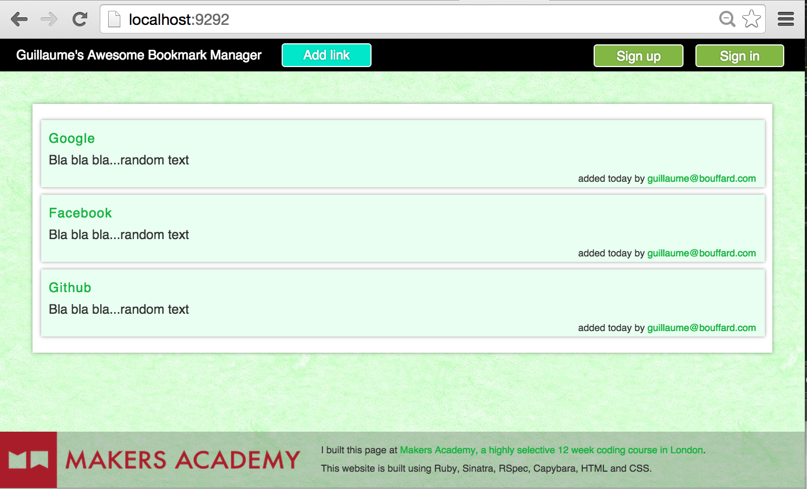
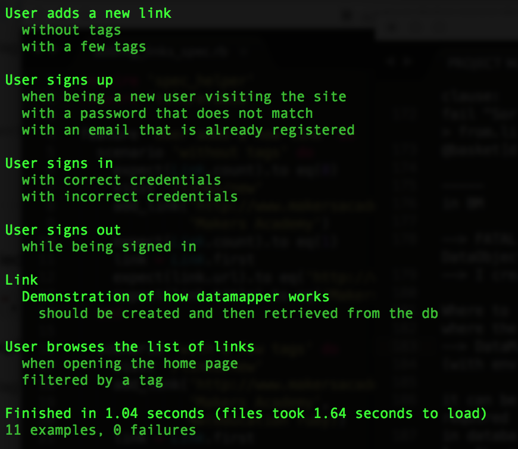

:bookmark: Bookmark-Manager :bookmark:
===
This is me re-doing from scratch the Makers Academy tutorial: Bookmark Manager. We were supposed to build a Bookmark Manager also working with a users management system/database: users can create an account, login, post links and recover their password if necessary.



Objectives of exercise
----
To learn about SQL databases and their integrations with ruby and with a Sinatra server through. Also, to learn about HTML and CSS.

Technologies used
----
- Ruby
- Postgresql
- DataMapper & DatabaseCleaner
- Rspec and Capybara
- Sinatra
- Git
- Bcrypt
- Rack-flash
- HTML and CSS

How to run it
----
```
git clone git@github.com:GBouffard/bookmark-manager.git
cd bookmark-manager
bundle
psql
CREATE DATABASE "bookmark_manager_test";
CREATE DATABASE "bookmark_manager_development";
rackup
```
you can now connect on localhost:9292, sign up, in, out and create bookmarks with tags.

How to run tests
----
```
cd bookmark-manager
rake
```

and this is what you should see:

